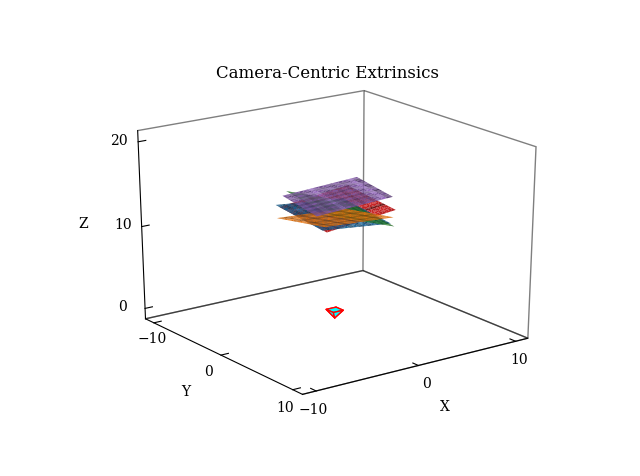
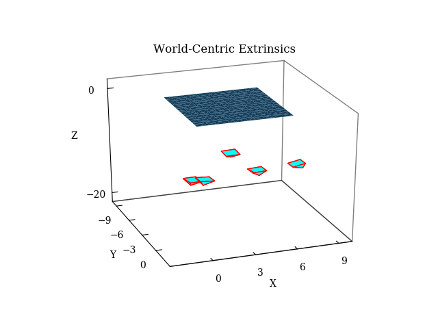

# Camera Calibration

This project implements Zhengyou Zhang's "A Flexible New Technique for Camera Calibration" (2000).

Wilhelm Burger's ["Zhang's Camera Calibration Algorithm: In-Depth Tutorial and Implementation" (2016) ](http://staff.fh-hagenberg.at/burger/publications/reports/2016Calibration/Burger-CameraCalibration-20160516.pdf) provided substantial aid to my understanding of details in the original paper.

## Usage

`python calibrate.py --data_dir=<data_directory_path>`

* `data_dir` - Path to the directory containing the control point file and the image point files. Each file must contain an even number of space-separated values of <x, y> points.

## Dependencies

* Python - Tested on version 3.7.0
* Matplotlib - Tested on version 2.0.2
* NumPy - Tested on version 1.15.0
* OpenCV - Tested on version 3.4.1
* Scipy - Tested on version 0.19.1

## Results

Here is a comparison  with Zhang's original results (available [here](https://www.microsoft.com/en-us/research/uploads/prod/2016/12/completecalibration.txt)):

|    | Implementation | Ground Truth   |
|----|----------------|----------------|
|`fx`| 832.499        | 832.500        |
|`fy`| 832.529        | 832.530        |
|`s` |   0.204503     |   0.204494     |
|`px`| 303.959        | 303.959        |
|`py`| 206.585        | 206.585        |
|`q1`|  -0.228602     |  -0.228601     |
|`q2`|   0.190355     |   0.190353     |

`fx` and `fy` are the intrinsic focal length parameters, `s` represents skew, and `px` and `py` are the principal point offsets. `q1` and `q2` are distortion model coefficients for the radial distortion model.

To visualize the calibration results, here are the calculated world- and camera-centric extrinsic parameters from the original dataset:

